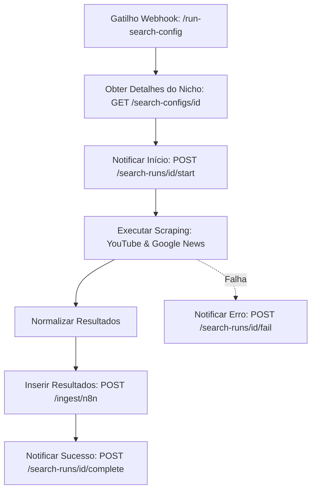

# Integração de Busca Manual com n8n

Este documento orienta sobre a criação e parametrização do workflow de busca manual no **n8n** integrado com as APIs de nichos e execuções do portal **Dark Content Radar**.

---

## Desenho do Workflow no n8n

O workflow no n8n deve escutar gatilhos do tipo Webhook, interagir com a API de controle do portal para obter parâmetros e reportar o andamento da execução.



---

## 1. Gatilho do Webhook (Recebimento da Execução)

O webhook do n8n deve ser registrado com o caminho `/run-search-config` (método `POST`).
Este webhook receberá o seguinte payload vindo do portal:

```json
{
  "search_config_id": 1,
  "search_run_id": 42
}
```

> [!NOTE]
> Salve estes valores em variáveis de contexto (`search_config_id` e `search_run_id`) para usar nos nós seguintes.

---

## 2. Obter Parâmetros de Pesquisa (HTTP Request)

Faça uma requisição do tipo **GET** para obter as palavras-chave e parâmetros configurados:

* **Método:** `GET`
* **URL:** `http://backend:8000/search-configs/{{$json.search_config_id}}`
* **Headers:** `Content-Type: application/json`

O portal responderá com a configuração detalhada:
```json
{
  "id": 1,
  "name": "Inteligência Artificial",
  "description": "Foco em ferramentas de produtividade e LLMs",
  "status": "active",
  "language": "pt",
  "country_code": "BR",
  "region_code": null,
  "days_back": 5,
  "min_views": 30000,
  "max_results_per_query": 50,
  "sources_json": ["youtube", "google_news"],
  "keywords_json": ["inteligencia artificial", "ia produtividade"],
  "negative_keywords_json": ["curso gratis"],
  "youtube_categories_json": ["28"]
}
```

---

## 3. Notificar Início de Execução (HTTP Request)

Antes de iniciar as buscas, mude o status do run para `running` no portal:

* **Método:** `POST`
* **URL:** `http://backend:8000/search-runs/{{$json.search_run_id}}/start`

Isso preencherá automaticamente o campo `started_at` com o timestamp atual.

---

## 4. Executar Scraping e Normalização

1. Itere sobre a lista `keywords_json`.
2. Para cada palavra-chave, execute as chamadas de API do **YouTube** (Shorts/Vídeos) e **Google News**.
3. Filtre os resultados aplicando as palavras-chave negativas (`negative_keywords_json`), as visualizações mínimas (`min_views`) e a janela temporal (`days_back`).

---

## 5. Salvar Resultados no Banco (HTTP Request)

Ao enviar os novos conteúdos coletados para o endpoint de ingestão do portal (`POST /ingest/n8n`), envie também as referências de origem `search_config_id` e `search_run_id` dentro do payload de cada item.

Exemplo de payload de item enviado no lote:

```json
[
  {
    "source": "youtube",
    "external_id": "v1d30_1D",
    "content_type": "video",
    "title": "Como usar IA para automatizar tarefas",
    "description": "Tutorial rápido e prático...",
    "url": "https://youtube.com/watch?v=v1d30_1D",
    "channel_title": "Canal Tech IA",
    "published_at": "2026-06-04T12:00:00Z",
    "views": 45000,
    "likes": 2500,
    "comments": 120,
    "views_per_day": 45000.0,
    "score": 85.5,
    "topic_seed": "Inteligência Artificial",
    "discovery_query": "ia produtividade",
    "language": "pt",
    "country_code": "BR",
    "raw_json": { "detalhes": "brutos" },
    "search_config_id": 1,
    "search_run_id": 42
  }
]
```

---

## 6. Notificar Conclusão da Execução (HTTP Request)

No final da execução com sucesso, atualize o portal informando as métricas obtidas:

* **Método:** `POST`
* **URL:** `http://backend:8000/search-runs/{{$json.search_run_id}}/complete`
* **Payload:**
  ```json
  {
    "items_found": 15,
    "items_inserted": 12,
    "items_updated": 3,
    "raw_summary_json": {
      "execution_time_seconds": 124,
      "quota_used": 150
    }
  }
  ```

---

## 7. Tratamento de Erro (HTTP Request)

Se o workflow do n8n falhar em qualquer etapa, utilize um nó **Error Trigger** ou condicional para notificar a falha ao portal:

* **Método:** `POST`
* **URL:** `http://backend:8000/search-runs/{{$json.search_run_id}}/fail`
* **Payload:**
  ```json
  {
    "error_message": "A chamada à API do YouTube estourou a cota diária ou falhou de rede.",
    "raw_summary_json": {
      "failed_at_step": "Scraping YouTube"
    }
  }
  ```
