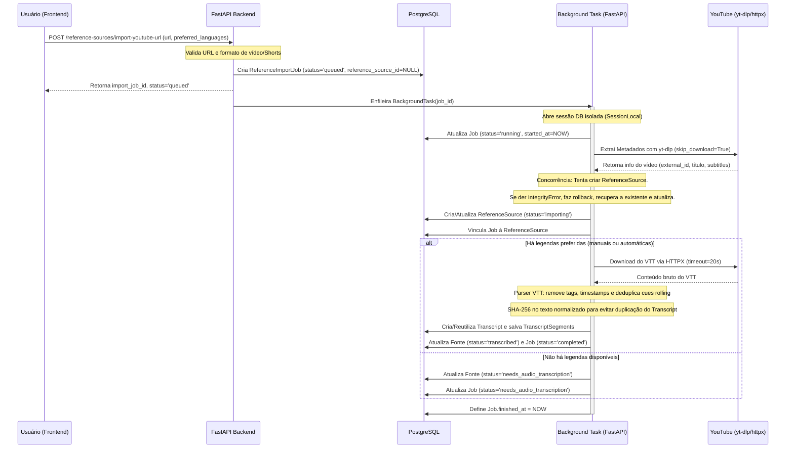

# Referências e Transcrições por URL

Este módulo permite ao utilizador colar a URL de um vídeo (ou Shorts) do YouTube no Dark-Content-Radar para extrair automaticamente metadados e legendas (transcrições), criando uma fonte de referência no portal sem a necessidade de baixar os arquivos de áudio ou vídeo (economia de banda e armazenamento).

## Arquitetura e Fluxo de Importação



## Limitações do BackgroundTasks (FastAPI)

> [!NOTE]
> O uso do `BackgroundTasks` do FastAPI é extremamente conveniente e adequado para o escopo do **MVP local** e de testes. Contudo, as tarefas rodam na memória do próprio processo do servidor web.
>
> Se o servidor web for reiniciado, parado ou sofrer um crash, **as tarefas enfileiradas em memória que ainda não iniciaram serão perdidas**.
>
> Para ambientes de produção ou escala de uso elevado, recomenda-se substituir o `BackgroundTasks` por um mecanismo de filas persistente e assíncrono robusto, tais como:
> 1. **Celery com Redis/RabbitMQ**: Fila persistente padrão em ecossistemas Python.
> 2. **n8n Webhook / Workers**: Delegar o processamento da fila ao próprio n8n.
> 3. **RQ (Redis Queue)**: Fila leve em Python baseada no Redis.

## Como Testar Endpoints

### 1. Importação de URL
Disparar a importação enviando o JSON no payload:
```bash
curl -X POST "http://localhost:8000/reference-sources/import-youtube-url" \
     -H "Content-Type: application/json" \
     -d '{
       "url": "https://www.youtube.com/watch?v=dQw4w9WgXcQ",
       "preferred_languages": ["pt", "pt-BR", "en"],
       "allow_auto_captions": true
     }'
```
Resposta esperada:
```json
{
  "reference_source_id": null,
  "import_job_id": 1,
  "status": "queued"
}
```

### 2. Acompanhamento do Job (Polling)
Fazer requisições GET periódicas com o ID retornado:
```bash
curl -X GET "http://localhost:8000/reference-import-jobs/1"
```
Resposta esperada (em execução):
```json
{
  "id": 1,
  "reference_source_id": null,
  "source_url": "https://www.youtube.com/watch?v=dQw4w9WgXcQ",
  "status": "running",
  "method": "yt_dlp_captions",
  ...
}
```
Resposta esperada (finalizado):
```json
{
  "id": 1,
  "reference_source_id": 4,
  "source_url": "https://www.youtube.com/watch?v=dQw4w9WgXcQ",
  "status": "completed",
  ...
}
```

### 3. Listagem de Referências
Listar as fontes importadas com filtros opcionais:
```bash
curl -X GET "http://localhost:8000/reference-sources?limit=10&offset=0&status=transcribed"
```

### 4. Visualização de Transcrição e Segmentos
Obter a transcrição e a lista de timestamps correspondentes:
```bash
curl -X GET "http://localhost:8000/reference-sources/4/transcripts"
curl -X GET "http://localhost:8000/transcripts/1/segments"
```

## Como Usar o Painel no Portal

1. Aceda ao item **Referências / Transcrições** no menu da barra lateral esquerda.
2. No topo, insira o link de um vídeo do YouTube ou Shorts. Se desejar, configure a ordem dos idiomas preferidos (ex: `pt, en`) e a permissão para legendas automáticas geradas por IA.
3. Clique em **Importar Vídeo**. O portal enviará a requisição em segundo plano, exibindo a tarefa em execução no card de status à direita.
4. O polling automático atualizará o andamento. Assim que o processamento terminar:
   - Se o vídeo possuir legendas, o status mudará para **Transcrito** (verde).
   - Se o vídeo não contiver legendas disponíveis, o status mudará para **Pendente de Áudio** (amarelo), informando que será transcrito por áudio nas próximas etapas do portal.
5. Clique no ícone de visualização (olho) na tabela de referências para abrir a tela de detalhe.
6. Na tela de detalhes, poderá alternar entre o **Texto Completo** da transcrição (ideal para leitura corrida) e os **Segmentos** (útil para ver timestamps e momentos do vídeo). Use os botões de cópia rápida para exportar o texto.
